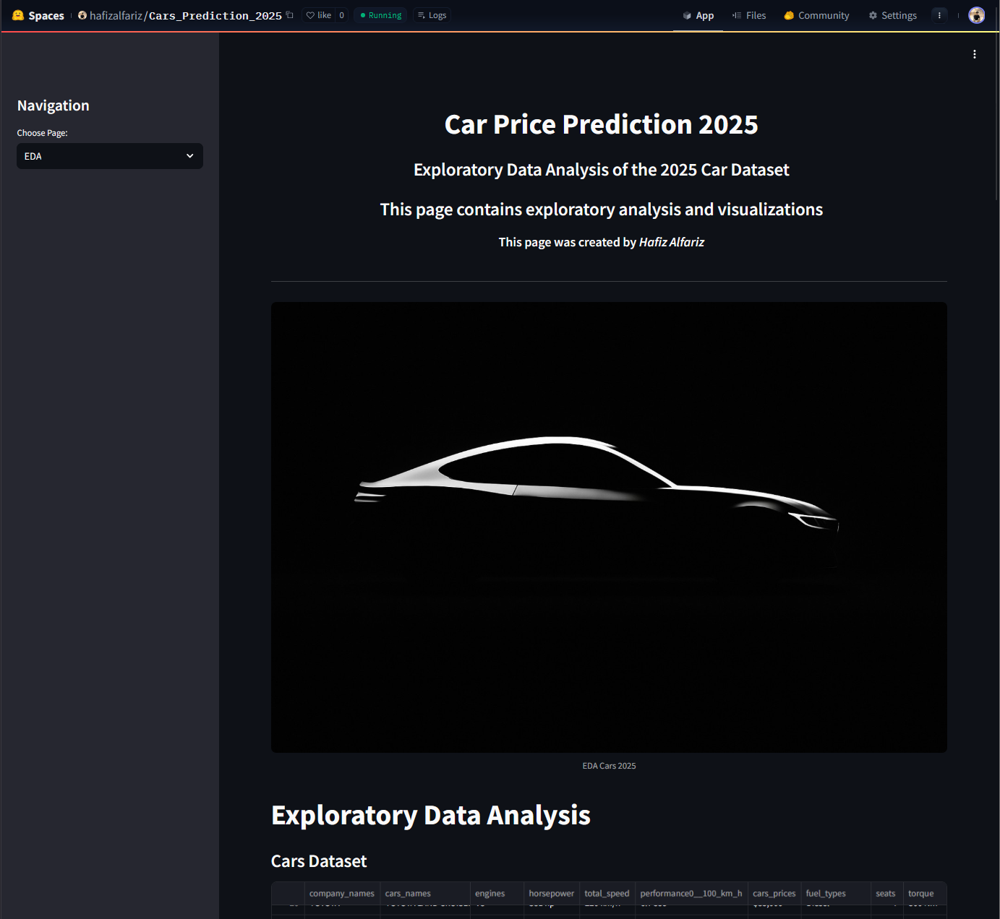
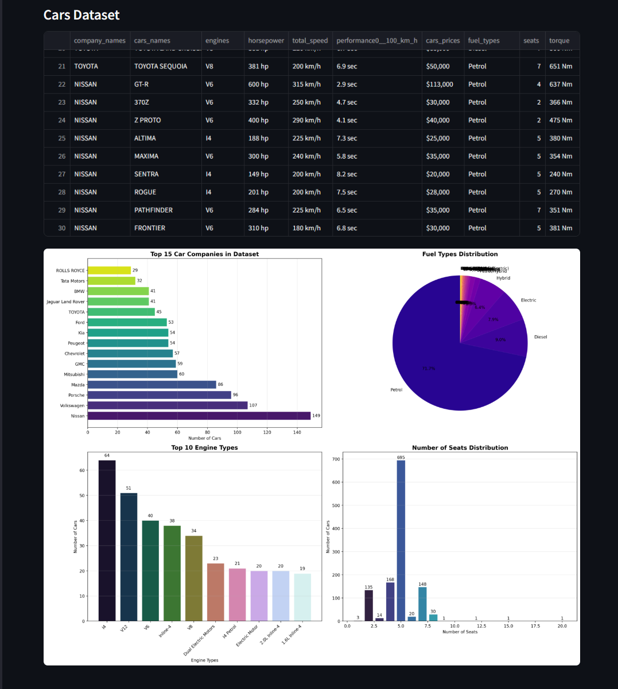
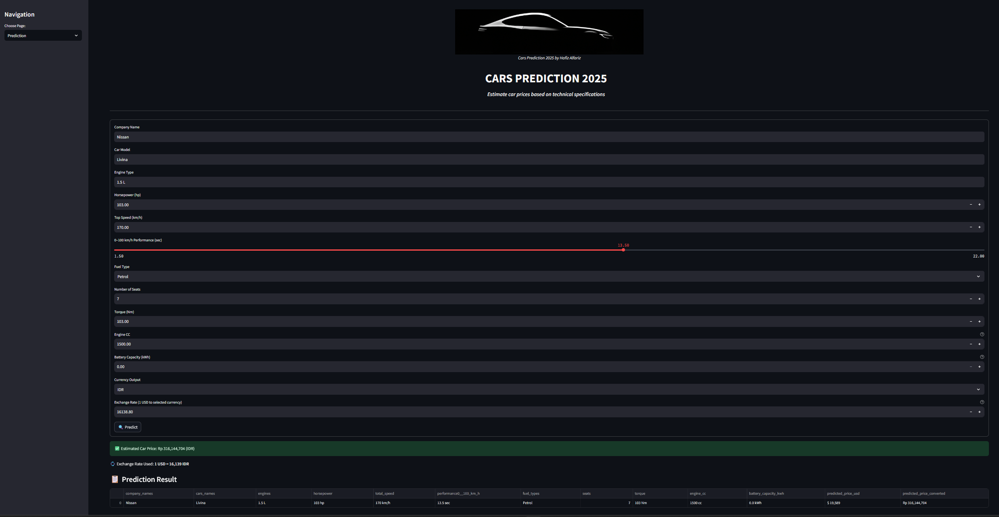

# Project Title

> Prediction of New Car Prices in 2025 Based on Technical Specifications

## Repository Outline

1. README.md / description.md - General project overview and documentation
2. car_price_prediction.ipynb - Main notebook containing the complete data science process: data loading, cleaning, EDA, feature engineering, modeling, evaluation, and conclusion
3. Cars_Datasets_2025.csv - Raw dataset from Kaggle
4. best_xgb_rand.pkl - XGBoost model after hyperparameter tuning (RandomizedSearchCV)
5. preprocessing_pipeline.pkl - Preprocessing pipeline for inference
6. images - hugging face page screenshoot
7. deployment:
> - best_xgb_rand.pkl - Best XGBoost model after tuning
> - cars_cleaned.csv - Cleaned data
> - edatest.py - For EDA visualization on Hugging Face
> - Logo.PNG - Image for aesthetics
> - preprocessing_pipeline.pkl - Pipeline for prediction
> - streamlit_app.py - For integrating pages on Hugging Face

## Problem Background
`The automotive industry in 2025 is highly competitive, with hundreds of new car models from various global brands. Manufacturers and market analysts need a way to understand how technical specifications (such as horsepower, engine capacity, speed, fuel type, etc.) affect the price of new cars. This project aims to build a new car price prediction model based on technical specification data, which can be used for pricing strategy, positioning, and product development.`

## Project Output
> - Machine learning model (XGBoost) capable of predicting new car prices in 2025 based on technical specifications.
> - Preprocessing pipeline ready for inference on new data.
> - Business analysis related to price segmentation, brand performance, and the most influential features on price.
> - EDA visualizations, price distribution, feature correlations, and model evaluation.
> - Deployment on Hugging Face for prediction website and EDA.

## Data
> - Source: Kaggle - Cars Datasets 2025
> - Size: 1218 rows, 11 columns (after cleaning: >1200 rows, 10+ main features)
> - Features: Brand name, car name, engine type, engine/battery capacity, horsepower, max speed, acceleration, price, fuel type, number of seats, torque.
> - Target: New car price (cars_prices)
> - Missing Values: Handled with manual/statistical imputation
> - Duplicates: Removed
> - Format: Many numeric columns were originally strings with units/ranges, now converted to numeric

## Method
> - Supervised Regression: Linear Regression, Random Forest, XGBoost, Gradient Boosting
> - Feature Engineering: Category grouping (brand, engine, car name, fuel type, seats), scaling, encoding
> - Outlier Handling: IQR capping, selective removal
> - Hyperparameter Tuning: GridSearchCV & RandomizedSearchCV for XGBoost
> - Model Evaluation: R², RMSE (log), MAE, residual analysis, cross-validation

## Stacks
> - Python 3.x
> - Jupyter Notebook
> - Pandas, NumPy, Matplotlib, Seaborn
> - Scikit-learn, XGBoost
> - Cloudpickle (model saving)
> - Statsmodels (statistical tests)

## Reference
> Kaggle Dataset
> Basic Writing and Syntax on Markdown
> otodriver
> autonetmagz
> wikipedia

---

**Additional References:**
Google Collab from hactiv8 https://colab.research.google.com/github/FTDS-learning-materials/phase-1/blob/v2.3/w1/P1W1D1PM%20-%20Machine%20Learning%20Problem%20Framing%20-%20Training.ipynb#scrollTo=vSm5K1cawY50

## Contact

For questions or collaboration, please contact Hafiz Alfariz via [LinkedIn](https://www.linkedin.com/in/hafizalfariz/) or GitHub.